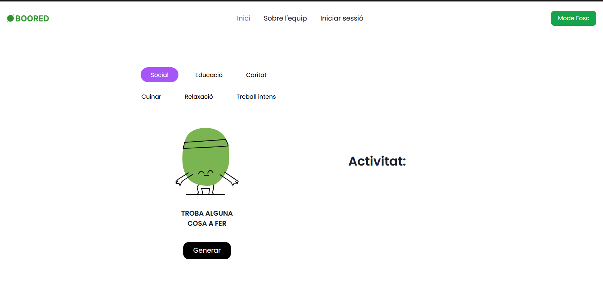
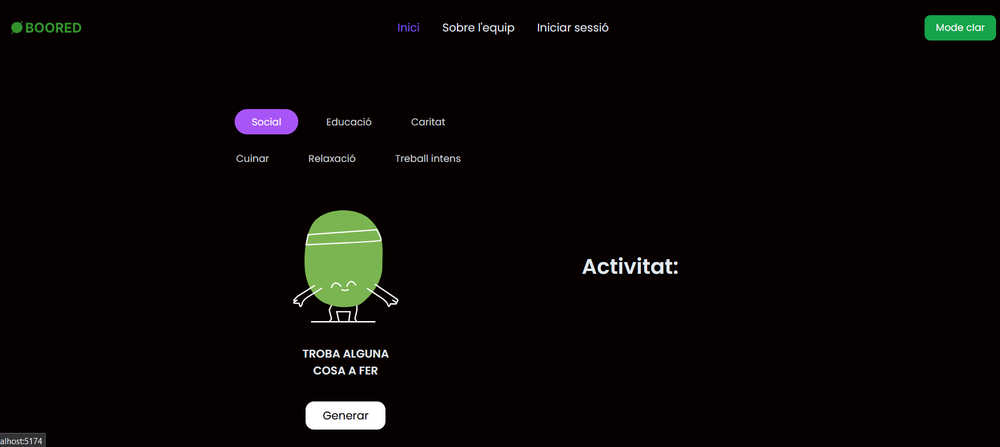
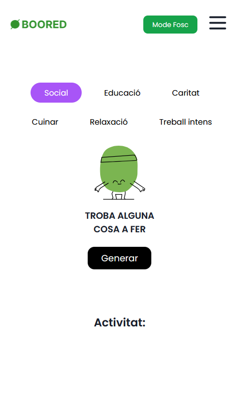
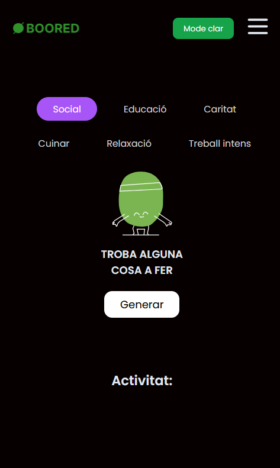

# 💻 Hackathon-Boored: Fun Activities Web App

Web application developed for the Occupy 2024 **Hackathon** that shows activities to do in moments of boredom, with personalised filters.

## 📋 Table of Contents
1. [Prerequisites](#-prerequisites)
2. [Installation](#-installation)
3. [Technologies Used](#-technologies-used)
4. [Starting the Project](#-starting-the-project)
5. [Features](#-features)
6. [Screenshots](#-screenshots)
7. [Contributing](#-contributing)
8. [Contact](#-contact)


1. ## 🔧 Prerequisites

 [Node.js](https://nodejs.org/)

2. ## 🛠 Installation

**Clone this repository:** 

```bash
   git clone https://github.com/jess-ar/hack-boored.git
```

 **Access the project:**

```bash
   cd react-hack-boored
```

 **Install the dependencies:**

```bash
   npm install
```

3. ## 📦Technologies Used
This project utilizes the following technologies:

- **React**: Library for building user interfaces.
- **TailwindCSS**: CSS framework for quickly styling the UI.
- **Axios**: Library for making asynchronous HTTP requests.
- **Bored API**: API that provides activities to do when bored.

4. ## 🚀 Starting the Project

- **Development:**

```bash
   npm run dev
```
   Use this command to start the development server. The server will automatically reload 	when changes are detected in your code.

5. ## ✨ Features

- Filter activities by category (Social, Education, Charity, etc.).
- Generates random activities when no filter is selected.
- Responsive design for both mobile and desktop devices.
- Light and dark mode support.

6. ## 🖼 Screenshots






7. ## 🤝 Contributing

Contributions are more than welcome! If you have suggestions for improvements, new features, or if you spot any bugs, feel free to open an issue or submit a pull request.

### Steps to Contribute:
1. **Fork the Repository**
2. **Create your Feature Branch**
   ```bash
   git checkout -b feature/AmazingFeature


8. ### 🎉 That's all, folks!

Thanks for checking out this project! If you enjoyed it, feel free to give it a ⭐️ on GitHub and follow me for more awesome projects!

Let's stay connected:
- **GitHub:** [jess-ar](https://github.com/jess-ar)
- **LinkedIn:** [Jessica Arroyo Lebrón](https://www.linkedin.com/in/jessica-arroyo-lebron/)

Got any questions or just want to say hi? Shoot me a message — I'd love to hear from you! ✨
